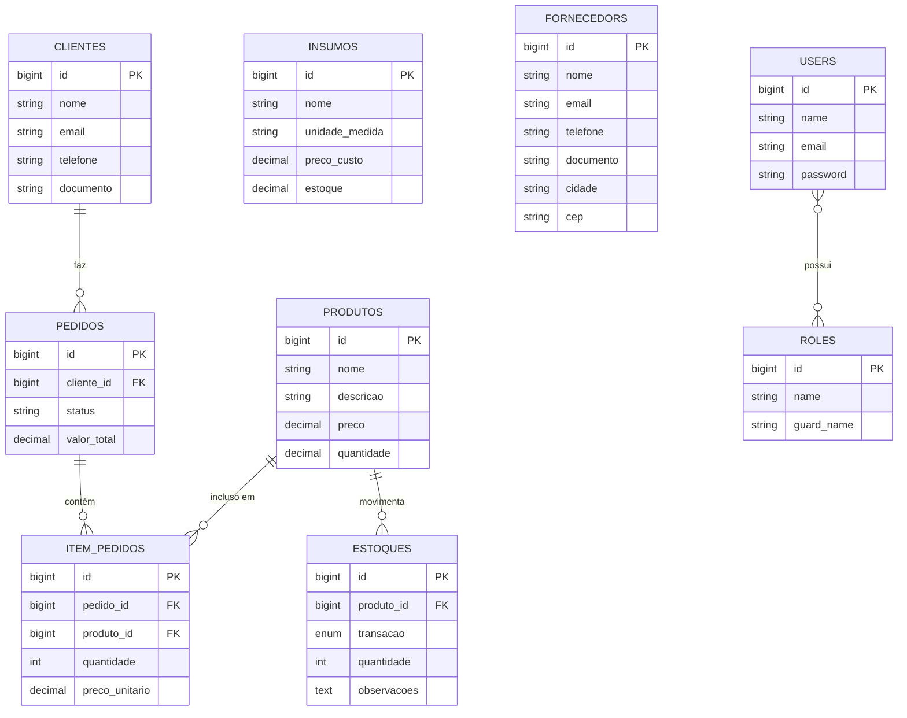
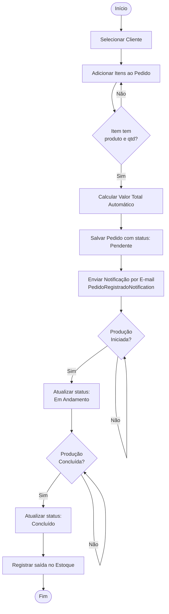
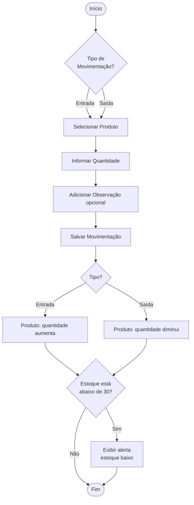
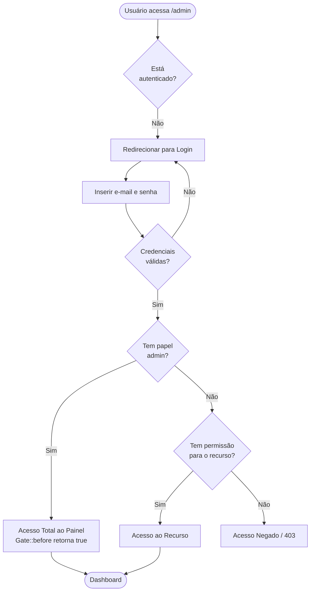
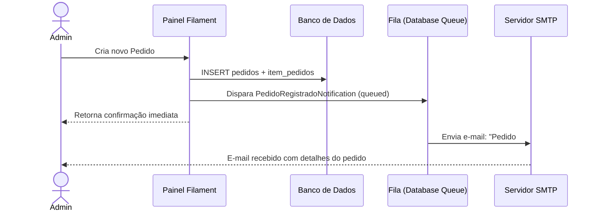
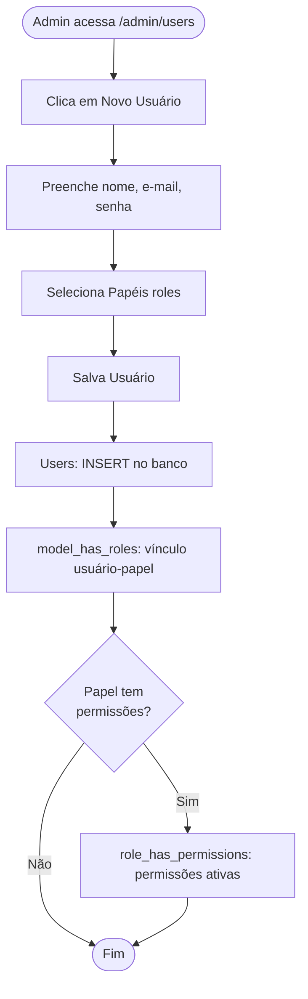
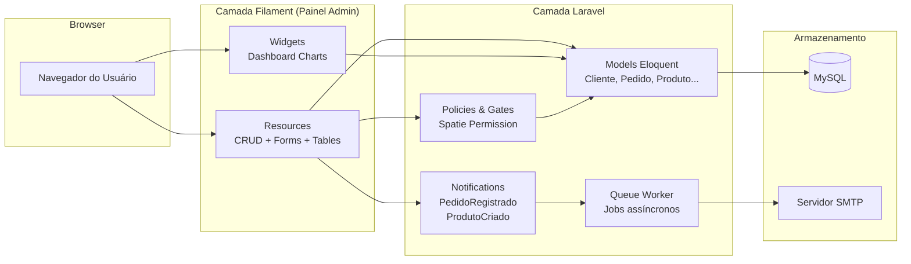

# ConfecçãoTA2 — Sistema de Gestão para Confecções

Sistema ERP voltado para a gestão de confecções, desenvolvido com **Laravel 13** e **Filament 5**. Cobre o ciclo completo da operação: cadastro de clientes e fornecedores, controle de insumos e produtos, gestão de pedidos e movimentação de estoque, com painel administrativo e relatórios em tempo real.

---

## Sumário

- [Tecnologias](#tecnologias)
- [Requisitos de Instalação](#requisitos-de-instalação)
- [Instalação](#instalação)
- [Funcionalidades](#funcionalidades)
- [Requisitos Funcionais](#requisitos-funcionais)
- [Requisitos Não Funcionais](#requisitos-não-funcionais)
- [Arquitetura e Fluxogramas](#arquitetura-e-fluxogramas)
- [Controle de Acesso](#controle-de-acesso)
- [Notificações](#notificações)
- [Dashboard](#dashboard)

---

## Tecnologias

| Camada | Tecnologia |
| --- | --- |
| Backend | Laravel 13, PHP 8.3+ |
| Painel Admin | Filament 5 |
| Autenticação & Permissões | Spatie Laravel Permission 7.2 |
| Banco de dados | MySQL 5.7+ |
| Fila de jobs | Database Queue |
| Frontend | Vite, Heroicons |
| Mail (dev) | SMTP local (porta 1025) |

---

## Requisitos de Instalação

- PHP >= 8.3
- Composer
- MySQL 5.7+ ou MariaDB
- Node.js >= 18 + NPM
- Servidor web (Apache/Nginx/Laragon)

---

## Instalação

```bash
# 1. Clonar o repositório
git clone <url-do-repo> confeccaoTA2
cd confeccaoTA2

# 2. Instalar dependências PHP
composer install

# 3. Instalar dependências JS
npm install && npm run build

# 4. Configurar ambiente
cp .env.example .env
php artisan key:generate

# 5. Configurar banco de dados no .env
# DB_DATABASE, DB_USERNAME, DB_PASSWORD

# 6. Executar migrations e seeders
php artisan migrate --seed

# 7. Iniciar filas (para notificações)
php artisan queue:work
```

**Usuário administrador padrão (criado pelo seeder):**

- E-mail: `admin@confeccao.com`
- Senha: definida no `AdminUserSeeder`

---

## Funcionalidades

### Clientes

- Cadastro completo com nome, e-mail, telefone e documento (CPF/CNPJ)
- Máscara automática de entrada para CPF e CNPJ
- Busca e filtro por período de cadastro
- Visualização de todos os pedidos vinculados

### Fornecedores

- Cadastro com nome, e-mail, telefone, CNPJ, cidade e CEP
- Máscara de entrada para CNPJ e CEP
- Controle dos materiais fornecidos

### Produtos (Produtos Acabados)

- Cadastro com nome, descrição, preço de venda e quantidade em estoque
- Exibição de preço no formato BRL (R$)
- Alertas de estoque baixo (< 30 unidades) e sem estoque (≤ 0)
- Relacionamento com itens de pedido e movimentações de estoque

### Insumos (Matérias-Primas)

- Cadastro com nome, unidade de medida, preço de custo e estoque atual
- Unidades flexíveis: metros, rolos, pacotes, caixas, unidades, etc.
- Filtro por tipo de unidade de medida
- Alerta de estoque baixo (< 50 unidades)

### Pedidos

- Criação de pedidos vinculados a clientes
- Adição de múltiplos itens (produtos + quantidade + preço unitário)
- Cálculo automático do valor total do pedido
- Ciclo de vida: **Pendente → Em Andamento → Concluído**
- Filtros por status, período e valor (> R$ 1.000)
- Notificação por e-mail ao registrar novo pedido

### Estoque

- Registro de movimentações de entrada e saída por produto
- Campo de observações por movimentação
- Filtro por tipo de transação (entrada/saída) e período
- Histórico auditável de todas as movimentações

### Usuários

- Cadastro de usuários com nome, e-mail e senha
- Atribuição de múltiplos papéis (roles) por usuário
- Filtro por e-mail verificado e período de cadastro

### Papéis e Permissões

- Criação de papéis (roles) com atribuição de permissões específicas
- Criação de permissões individuais
- Acesso restrito ao papel `admin`
- Gate global: usuários `admin` ignoram todas as verificações de permissão

---

## Requisitos Funcionais

| ID | Requisito |
| --- | --- |
| RF01 | O sistema deve permitir o cadastro, edição e exclusão de clientes com nome, e-mail, telefone e documento (CPF/CNPJ). |
| RF02 | O sistema deve permitir o cadastro, edição e exclusão de fornecedores com nome, e-mail, telefone, CNPJ, cidade e CEP. |
| RF03 | O sistema deve permitir o cadastro, edição e exclusão de produtos, incluindo preço de venda e controle de quantidade em estoque. |
| RF04 | O sistema deve permitir o cadastro, edição e exclusão de insumos (matérias-primas) com unidade de medida, preço de custo e estoque atual. |
| RF05 | O sistema deve permitir a criação de pedidos vinculados a clientes, com múltiplos itens e cálculo automático do valor total. |
| RF06 | O sistema deve permitir a atualização do status de pedidos entre: Pendente, Em Andamento e Concluído. |
| RF07 | O sistema deve registrar movimentações de estoque (entrada e saída) por produto, com observações opcionais. |
| RF08 | O sistema deve enviar notificação por e-mail ao administrador quando um novo pedido for registrado. |
| RF09 | O sistema deve exibir alertas visuais para produtos com estoque baixo (< 30) e sem estoque (≤ 0). |
| RF10 | O sistema deve exibir alertas visuais para insumos com estoque baixo (< 50). |
| RF11 | O sistema deve permitir o cadastro de usuários com atribuição de papéis (roles) e permissões. |
| RF12 | O sistema deve restringir o acesso às telas de Papéis e Permissões somente a usuários com papel `admin`. |
| RF13 | O sistema deve exibir um dashboard com estatísticas de faturamento, pedidos por status e tendências mensais. |
| RF14 | O sistema deve suportar busca e filtragem em todas as listagens (clientes, fornecedores, produtos, insumos, pedidos, estoque). |
| RF15 | O sistema deve calcular e exibir variação percentual de faturamento entre o mês atual e o anterior no dashboard. |

---

## Requisitos Não Funcionais

| ID | Categoria | Requisito |
| --- | --- | --- |
| RNF01 | Segurança | Todas as senhas devem ser armazenadas com hash bcrypt. |
| RNF02 | Segurança | O acesso ao painel administrativo exige autenticação. |
| RNF03 | Segurança | O controle de acesso por papéis e permissões utiliza a biblioteca Spatie, padrão de mercado. |
| RNF04 | Segurança | Usuários `admin` têm acesso irrestrito via Gate global, sem necessidade de permissões explícitas. |
| RNF05 | Desempenho | As notificações por e-mail devem ser processadas de forma assíncrona via fila (queue), sem bloquear a requisição do usuário. |
| RNF06 | Desempenho | Selects de relacionamento (clientes, produtos) utilizam carregamento antecipado (preload) para reduzir queries. |
| RNF07 | Usabilidade | Campos de CPF, CNPJ, telefone e CEP utilizam máscara de entrada automática. |
| RNF08 | Usabilidade | O painel deve ser responsivo e acessível via browser moderno. |
| RNF09 | Manutenibilidade | A aplicação segue a arquitetura MVC do Laravel e as convenções do Filament. |
| RNF10 | Manutenibilidade | Migrations e Seeders documentam e reproduzem o esquema do banco de dados. |
| RNF11 | Confiabilidade | Exclusões em cascata garantem integridade referencial (ex.: excluir pedido remove seus itens). |
| RNF12 | Escalabilidade | O driver de filas pode ser trocado de `database` para Redis sem mudanças no código da aplicação. |
| RNF13 | Auditoria | Todas as movimentações de estoque são registradas com timestamp e observação opcional. |
| RNF14 | Internacionalização | Preços exibidos no formato BRL (R$) com duas casas decimais. |

---

## Arquitetura e Fluxogramas

### Modelo Entidade-Relacionamento



---

### Fluxo de Ciclo de Vida de um Pedido



---

### Fluxo de Movimentação de Estoque



---

### Fluxo de Autenticação e Controle de Acesso



---

### Fluxo de Notificação por E-mail



---

### Fluxo de Cadastro de Usuário e Atribuição de Papel



---

### Arquitetura de Camadas da Aplicação



---

## Controle de Acesso

A aplicação usa **Spatie Laravel Permission** com a seguinte estratégia:

- Usuários com papel **`admin`** têm acesso irrestrito (via `Gate::before`).
- Os recursos de **Roles** e **Permissions** exigem a permissão `admin` para serem acessados.
- Demais recursos são acessíveis a qualquer usuário autenticado por padrão, podendo ser refinados com políticas adicionais.

---

## Notificações

| Notificação | Gatilho | Canal | Assíncrona |
| --- | --- | --- | --- |
| `PedidoRegistradoNotification` | Criação de novo pedido | E-mail | Sim (queued) |
| `ProdutoCriadoNotification` | Cadastro de novo produto | E-mail | Sim (queued) |

---

## Dashboard

O painel inicial exibe quatro widgets:

| Widget | Tipo | Conteúdo |
| --- | --- | --- |
| Estatísticas Gerais | Stats Overview | Faturamento total, total de pedidos, pedidos pendentes, total de clientes |
| Faturamento Mensal | Gráfico de linhas | Receita dos últimos 12 meses (apenas pedidos concluídos) |
| Pedidos por Status | Gráfico de rosca | Distribuição: Pendente, Em Andamento, Concluído |

O widget de faturamento calcula também a **variação percentual mês a mês** e exibe um **gráfico de tendência dos últimos 12 meses**.

---

## Licença

Este projeto está licenciado sob a [MIT License](https://opensource.org/licenses/MIT).
